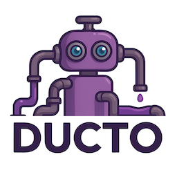

<p align="right">

</p>

# Ducto

## 🟣 What is Ducto?
**Ducto** is an open-source, modular, and declarative transformation engine designed to manipulate structured data (JSON-like objects) using simple, embeddable, and powerful instructions.

Ducto aims to bridge the gap between raw event streams, ETL pipelines, and dynamic data-driven systems by providing a flexible **Domain Specific Language (DSL)** that allows you to:
- Filter, mutate, and reshape incoming data
- Perform conditional logic, mappings, and transformations
- Integrate seamlessly into any Go-based CLI, service, or pipeline

## ✨ Why Ducto?
- ⚙ Composable - Build complex transformations by combining small, understandable instructions
- 🚀 Optimized for Real-World ETL - Designed to handle event streams, API payloads, and telemetry data at scale
- 📦 Lightweight - Single-purpose library with minimal dependencies
- ✅ Testable - Full suite of unit, integration, and end-to-end tests
- 🟣 Extensible - Designed with operators and instructions as first-class citizens
- 🌐 OpenTelemetry Ready - Hooks for observability without polluting your logic
- 🟢 Serverless-First - Ducto is designed to run:
  - Locally as a CLI
  - Inside serverless environments (Cloud Run, Lambda, etc.)
  - Or embedded directly into your services

## 🛠️ Features
- Declarative instruction set
- DSL versioning & strict validation
- Conditional logic (if, exists, and, or)
- Array mapping (map)
- Simple operators (set, copy, delete, replace, merge)
- JSON conversion operators (to_json, from_json)
- Error handling modes (fail, ignore, collect)
- Pluggable metrics and observability (optional)

## 💡 Project Vision
Ducto is intended to grow into a:

1. High-quality open-source toolkit for data transformation and processing
1. Foundation for more advanced tools:
   - Event stream processors
   - Feature-flag aware routing engines
   - Policy-driven data transformers
   - Real-time telemetry augmentation
1. Building block for the Ducto Project Ecosystem including:
   - [Ducto Transformer](https://github.com/tommed/ducto-dsl)
   - Ducto Feature Flag Engine
   - Ducto Stream Orchestrator

## 📦 Getting Started
```bash
echo '{"foo": "bar"}' | ducto-transformer examples/simplest.json
```

## 📚 Documentation
Full DSL specification is available in [specs.md](https://github.com/tommed/ducto-dsl/blob/main/docs/specs.md).

## 🧰 About the Author
Ducto is part of an ongoing open-source initiative by [@tommed](https://linkedin.com/in/tommed) to bring high-quality, composable, and reusable components to data processing pipelines and system integration workflows.

## ✅ License
## License

- Code is all licensed under [MIT](https://github.com/tommed/ducto-dsl/blob/main/LICENSE)
- Logos/Illustrations are Copyright 2025 Tom Medhurst, all rights reserved.

## 🟣 Coming Soon
- ✅ First-class Feature Flag integration
- ✅ Stream orchestrator service
- ✅ Optional OTLP / Prometheus telemetry support
- ✅ Ready-to-deploy serverless bundles
